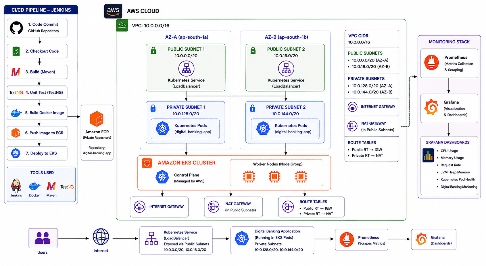

# End-to-End CI/CD Deployment of Cloud-Native Digital Banking Platform

An end-to-end DevOps project that automates the build, testing, containerization, deployment, and monitoring of a Spring Boot Digital Banking application on AWS.

## 🏗️ Architecture

**GitHub → Jenkins → Maven/TestNG → Docker → Amazon ECR → Ansible → Amazon EKS → LoadBalancer**

The application is deployed across separate **Development, Staging, and Production** Kubernetes namespaces with a manual approval before Production deployment.

## 🔄 CI/CD Pipeline

- GitHub source checkout
- Maven build and TestNG testing
- Test report generation
- Docker image build
- Amazon ECR authentication and image push
- Dev deployment and smoke test
- Staging deployment and smoke test
- Production approval
- Production deployment and smoke test

## 🛠️ Technologies

| Category | Technologies |
|---|---|
| Cloud | AWS |
| Source Control | GitHub |
| CI/CD | Jenkins |
| Application | Java, Spring Boot |
| Build & Testing | Maven, TestNG |
| Containerization | Docker |
| Registry | Amazon ECR |
| Automation | Ansible |
| Orchestration | Kubernetes, Amazon EKS |
| Monitoring | Prometheus, Grafana |
| Networking | Amazon VPC, LoadBalancer |

## ☸️ Kubernetes

The application runs on **Amazon EKS** using separate namespaces:

- `banking-dev`
- `banking-staging`
- `banking-prod`

The application is exposed externally through a Kubernetes **LoadBalancer Service**.

## 📊 Monitoring

Spring Boot exposes metrics through:

`/actuator/prometheus`

Prometheus collects the metrics and Grafana provides the monitoring dashboard.

### Grafana Panels

- CPU Usage
- Memory Usage
- Request Rate
- JVM Heap Memory
- Kubernetes Pod Health
- HTTP Error Rate

## 🔍 Verification

- Successful Jenkins pipeline and Stage View
- TestNG results generated
- Docker image pushed to Amazon ECR
- EKS nodes in Ready state
- Kubernetes Pods in Running/Ready state
- Successful deployment rollout
- LoadBalancer endpoint verified
- Application accessed through browser
- Banking transaction verified
- Spring Boot health check verified
- Prometheus targets verified
- Grafana dashboard verified

## 🧩 Troubleshooting

- Resolved Kubernetes manifest path issues in Ansible using `playbook_dir`.
- Configured Docker authentication for the private Amazon ECR repository.
- Verified Pod readiness and successful Kubernetes rollout.

## 📄 Project Documentation

For the complete step-by-step implementation with AWS screenshots, configuration, testing, and troubleshooting:

**[📄 View Project Implementation Report](./Report/Project-2-Digital_banking-cicd-project-report.pdf)**

## 👩‍💻 Author

**Jeni Balar**

Cloud & DevOps Project

